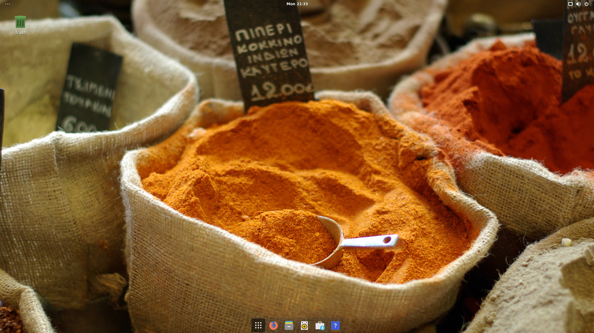
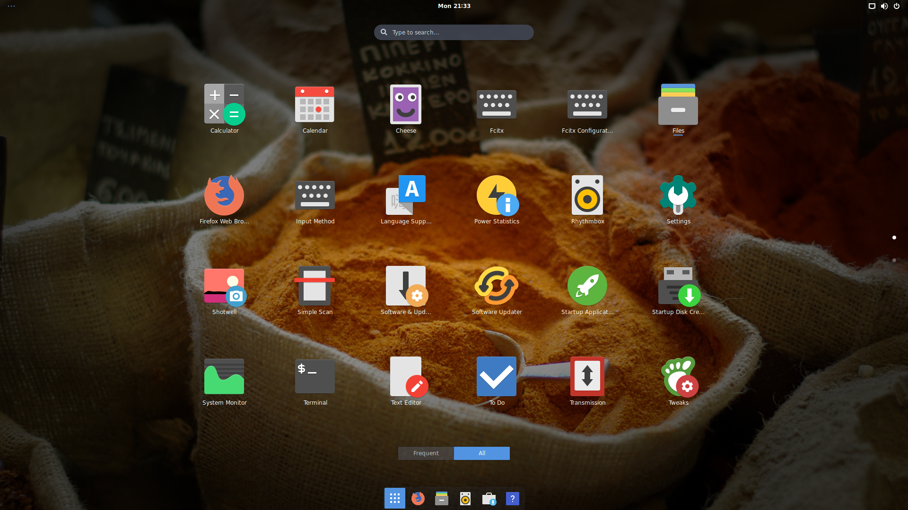

# On-My-Ubuntu
Try to make My Ubuntu 18.04 more awesome! :-D

Run the following command on your terminal, everying will be done automatically for you!

	sudo apt install curl -y
	curl -sLf https://raw.githubusercontent.com/gaunthan/Oh-My-Ubuntu/master/once_for_all.sh | bash

`once_for_all.sh` will call the following scripts

|script|function|
|--|--|
|setup_system.sh|Remove preinstalled useless packages such as gnome games, giving you a clean Ubuntu system. Also install recently used network tools.|
|beautify_gnome_shell.sh|Enable user-theme to beautify your desktop (new themes, new wallpapers). And make your topbar, dock more awesome.|
|enable_chinese_input.sh|No longer need to worry about how to input Chinese in other locale.|

If you just need one of them, feel free to call it directly, for example

	sudo apt install curl -y
	curl -sLf https://raw.githubusercontent.com/gaunthan/Oh-My-Ubuntu/master/beautify_gnome_shell.sh | bash

## Setup your system
Oh, I hate preinstalled packages that usually are useless or ad. So after system installation finished, I will run the following command to clean up the system

	sudo apt install curl -y
	curl -sLf https://raw.githubusercontent.com/gaunthan/Oh-My-Ubuntu/master/setup_system.sh | bash

## Beautify your gnome shell
You can run the following command to reborn your desktop

	sudo apt install curl -y
	curl -sLf https://raw.githubusercontent.com/gaunthan/Oh-My-Ubuntu/master/beautify_gnome_shell.sh | bash

If nothing wrong, your system will have a new look, as the following picutres shown.

### Desktop

### Apps Overview

If you do encounter problems, please enable user-theme manully by gnome-tweak-tools, and run this script again.

## Enable chinese input
You can run the following command to set up chinese input method

	sudo apt install curl -y
	curl -sLf https://raw.githubusercontent.com/gaunthan/Oh-My-Ubuntu/master/enable_chinese_input.sh | bash

You may need to log out for the change to take effect.

